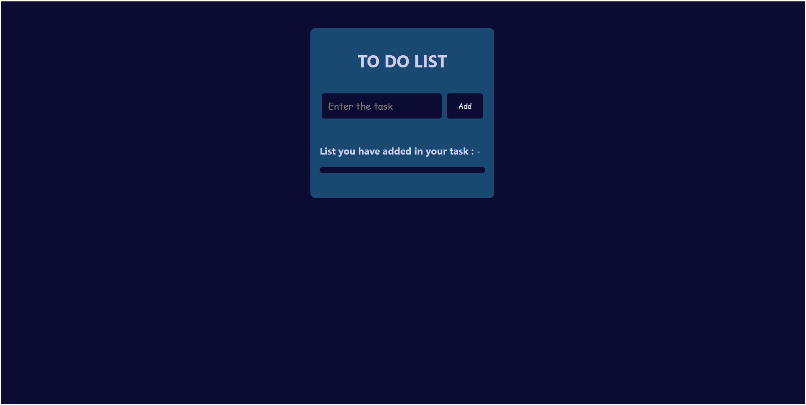
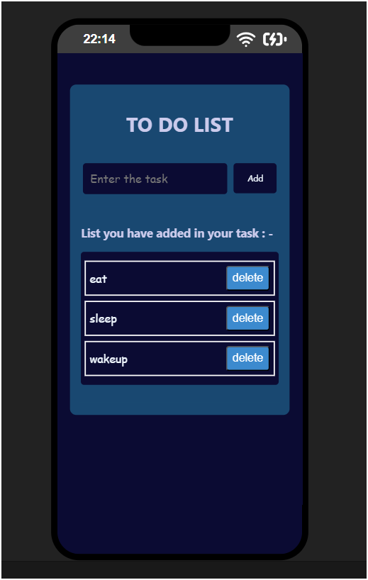

# To-do-list
This is a simple and responsive To-Do List application built using HTML, CSS, and JavaScript. This project helps users add, delete, and manage daily tasks with a clean and intuitive interface.

Features
Add new tasks with a single click
->Delete completed or unwanted tasks
->Input validation (prevents empty tasks)
->Responsive design – works on all screen sizes
->Built using plain JavaScript (no frameworks)

Tech Stack
HTML – Structure of the app
CSS – Styling and layout
JavaScript – Functionality (DOM manipulation, event handling)

📸 Preview

